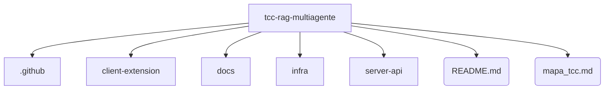

# Mapa da Estrutura do TCC

Este arquivo é **gerado automaticamente** pelo script `infra/scripts/auto_mapa.py`.
Não edite a árvore manualmente.

## 🌳 Árvore de Diretórios (Formato Markmap / Universal)

* **`tcc-rag-multiagente/`** (Raiz do Monorepo)
  * `README.md`
  * `mapa_tcc.md`
  * `.github/`
    * `workflows/`
  * `client-extension/`
    * `package.json`
    * `public/`
      * `content.js`
      * `manifest.json`
      * `popup.html`
    * `src/`
  * `docs/`
    * `arquitetura/`
    * `fases/`
      * `fase_0_fundacao.md`
      * `fase_1_infraestrutura.md`
      * `fase_2_backend.md`
      * `fase_3_frontend_e_governanca.md`
      * `fase_4_orquestracao_langgraph.md`
    * `qfd/`
    * `tcc_document/`
  * `infra/`
    * `docker/`
      * `docker-compose.yml`
    * `scripts/`
  * `server-api/`
    * `Dockerfile`
    * `requirements.txt`
    * `app/`
      * `agents.py`
      * `main.py`
    * `tests/`

---

## 📊 Grafo Arquitetural (Formato Mermaid)
*No GitHub, o bloco abaixo é renderizado automaticamente como um diagrama visual, focado na arquitetura de alto nível.*

